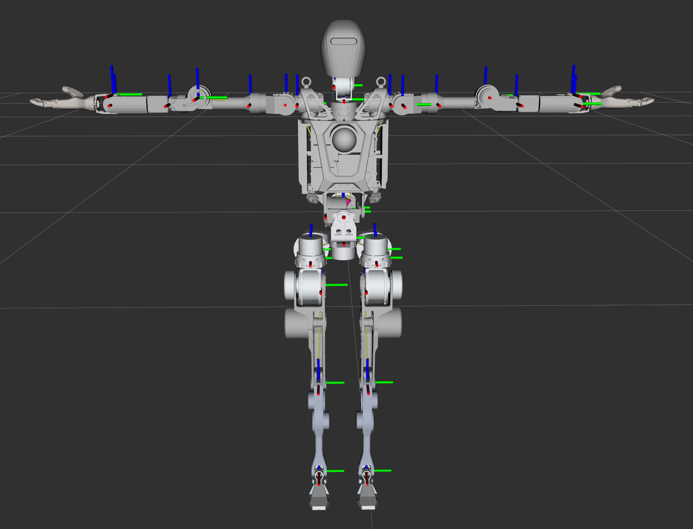
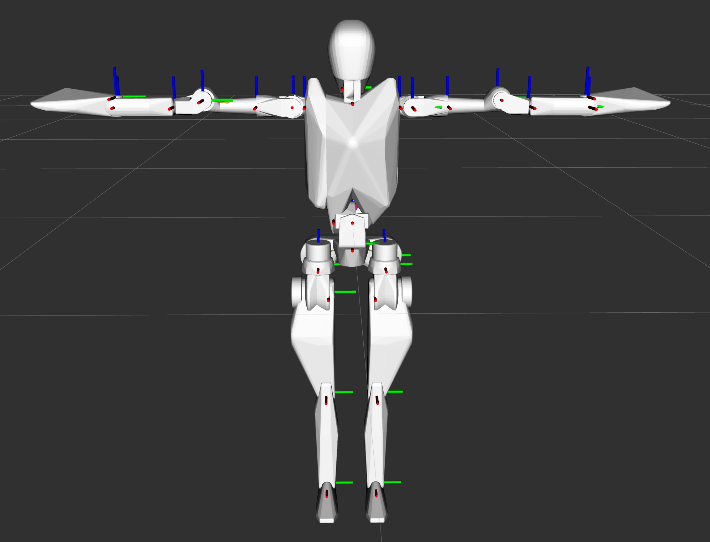
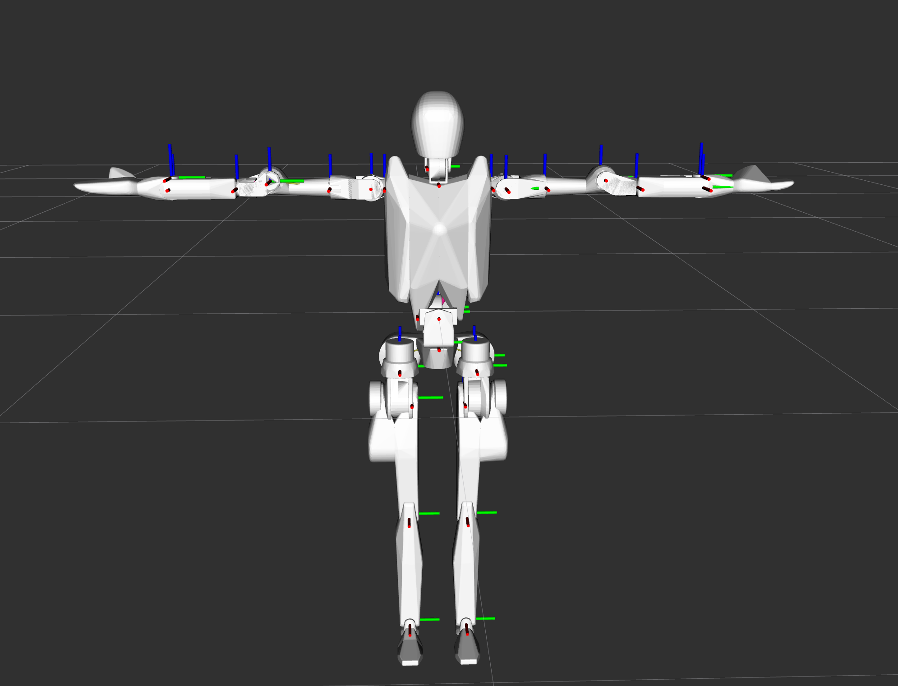
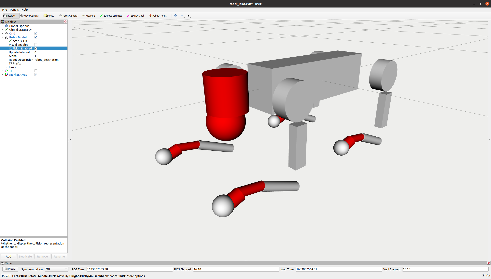

# URDF 碰撞几何体修改器

([English](README_EN.md) | [中文](README.md))

## 描述

URDF 碰撞几何体修改器是一个 Python 脚本，旨在处理和优化 URDF（统一机器人描述格式）文件中的碰撞几何体。它使用 COACD（基于凸优化的近似凸分解）算法将复杂的网格几何体分解为更简单的凸形状，这可以提高机器人仿真和应用中的碰撞检测性能。

## 特性

- 读取 URDF 文件并处理其碰撞几何体
- 使用 COACD 将复杂的网格几何体分解为更简单的凸形状
- 基于分解后的网格生成新的碰撞几何体
- 创建包含更新后碰撞信息的新 URDF 文件
- 支持自定义分解参数

## 前提条件

在开始之前，请确保您满足以下要求：

- Python 3.6 或更高版本
- pip（Python 包安装器）

## 安装

1. 克隆此仓库或下载脚本：

   ```
   git clone https://github.com/Alexbeast-CN/urdf-collision-modifier.git
   cd urdf-collision-modifier
   ```

2. 安装所需的 Python 包：

   ```
   pip install -r requirements.txt
   ```

## 使用方法

要使用 URDF 碰撞几何体修改器，请使用以下命令运行脚本：

```
python urdf_collision_modifier.py -u <URDF文件路径> -m <网格文件目录路径> [选项]
```

### 参数：

- `-u, --urdf`：输入 URDF 文件的路径（必需）
- `-m, --mesh_dir`：包含网格文件的目录路径（必需）
- `-t, --threshold`：终止分解的凹度阈值（0.01~1，默认值 = 0.05）
- `-pr, --preprocess_resolution`：流形预处理的分辨率（20~100，默认值 = 50）

### 示例：

OpenLoong 机器人分解前，总网格数 = 32：



运行脚本以分解碰撞几何体：

```
python3 urdf_collision_modifier.py -u openloong_description/urdf/AzureLoong.urdf -m <网格目录的绝对路径> -t 0.07 -pr 60
```

OpenLoong 机器人在 t = 0.35，pr = 30 分解后，总网格数 = 115：



OpenLoong 机器人在 t = 0.05，pr = 50 分解后，总网格数 = 249：



此命令将处理 URDF 文件，分解其碰撞几何体，并创建一个包含更新后碰撞信息的新 URDF 文件。

为了获得更好的性能，您可以手动使用简单的形状（如球体、圆柱体和立方体）定义碰撞几何体。宇树科技（Unitree）提供了一些很好的例子，例如 [Unitree Go2](https://github.com/unitreerobotics/unitree_ros/blob/master/robots/go2_description/urdf/go2_description.urdf)



## 输出

脚本将生成：

1. 在指定的网格目录中生成新的分解后的网格文件
2. 在输入 URDF 所在的目录中生成一个带有"_decomposed"后缀的新 URDF 文件

## 贡献

欢迎对 URDF 碰撞几何体修改器做出贡献。请随时提交拉取请求。

## 许可证

本项目采用 MIT 许可证 - 详情请见 LICENSE 文件。

## 致谢

- COACD 算法：[CoACD GitHub](https://github.com/SarahWeiii/CoACD)
- URDF 解析器：[urdf_parser_py](https://github.com/ros/urdf_parser_py)

## 联系方式

如果您有任何问题或反馈，请在 GitHub 仓库中开启一个 issue。
