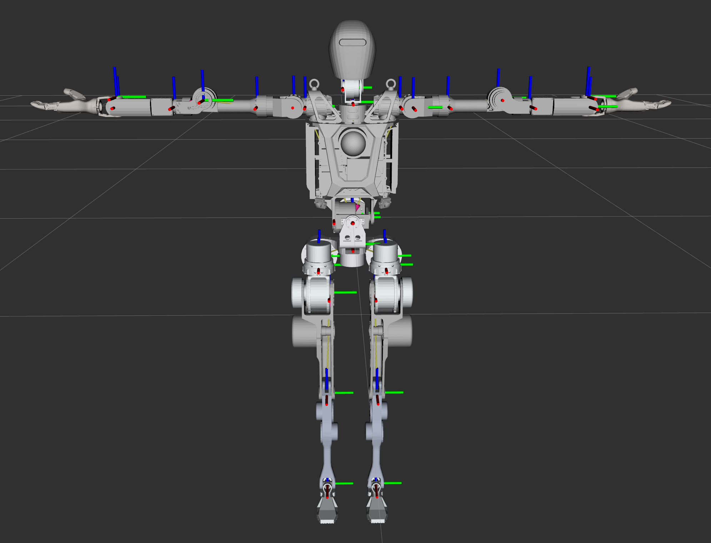
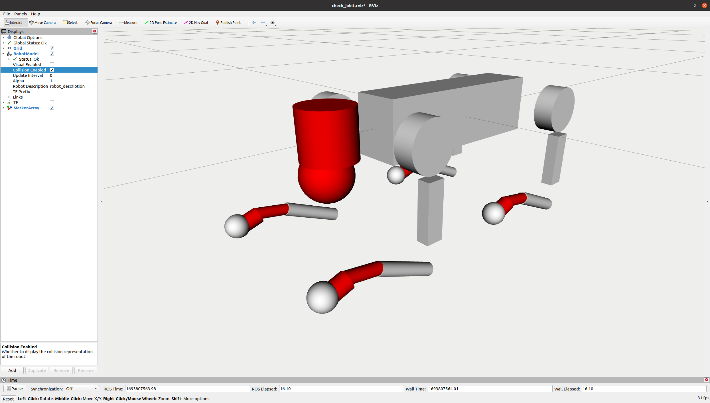

# URDF Collision Modifier

([English](README_EN.md) | [中文](README.md))


## Description

The URDF Collision Modifier is a Python script designed to process and optimize collision geometries in URDF (Unified Robot Description Format) files. It uses the COACD (Convex Optimization based Approximate Convex Decomposition) algorithm to decompose complex mesh geometries into simpler convex shapes, which can improve collision detection performance in robotics simulations and applications.

## Features

- Reads URDF files and processes their collision geometries
- Decomposes complex mesh geometries into simpler convex shapes using COACD
- Generates new collision geometries based on the decomposed meshes
- Creates a new URDF file with updated collision information
- Supports customization of decomposition parameters

## Prerequisites

Before you begin, ensure you have met the following requirements:

- Python 3.6 or higher
- pip (Python package installer)

## Installation

1. Clone this repository or download the script:

   ```
   git clone https://github.com/Alexbeast-CN/urdf-collision-modifier.git
   cd urdf-collision-modifier
   ```

2. Install the required Python packages:

   ```
   pip install -r requirements.txt
   ```

## Usage

To use the URDF Collision Modifier, run the script with the following command:

```
python urdf_collision_modifier.py -u <path_to_urdf> -m <path_to_mesh_directory> [options]
```

### Arguments:

- `-u, --urdf`: Path to the input URDF file (required)
- `-m, --mesh_dir`: Path to the directory containing mesh files (required)
- `-t, --threshold`: Concavity threshold for terminating the decomposition (0.01~1, default = 0.05)
- `-pr, --preprocess_resolution`: Resolution for manifold preprocess (20~100, default = 50)

### Example:

OpenLoong Robot before decomposition, total number of meshes = 32:



run the script to decompose the collision geometries:

```
python3 urdf_collision_modifier.py -u openloong_description/urdf/AzureLoong.urdf -m <the absolute path to the mesh directory> -t 0.07 -pr 60
```

OpenLoong Robot after decomposed with t = 0.35, pr = 30, total number of meshes = 115:


OpenLoong Robot after decomposed with t = 0.05, pr = 50, total number of meshes = 249:


This command will process the URDF file, decompose its collision geometries, and create a new URDF file with the updated collision information.

For better performance, you can manually define the collision geometries with simple shapes, such as spheres, cylinders, and boxes. The Unitree Robotics provides some good examples, ie [Unitree Go2](https://github.com/unitreerobotics/unitree_ros/blob/master/robots/go2_description/urdf/go2_description.urdf)



## Output

The script will generate:

1. New decomposed mesh files in the specified mesh directory
2. A new URDF file with the suffix "_decomposed" in the same directory as the input URDF

## Contributing

Contributions to the URDF Collision Modifier are welcome. Please feel free to submit a Pull Request.

## License

This project is licensed under the MIT License - see the LICENSE file for details.

## Acknowledgments

- COACD algorithm: [CoACD GitHub](https://github.com/SarahWeiii/CoACD)
- URDF Parser: [urdf_parser_py](https://github.com/ros/urdf_parser_py)

## Contact

If you have any questions or feedback, please open an issue in the GitHub repository.